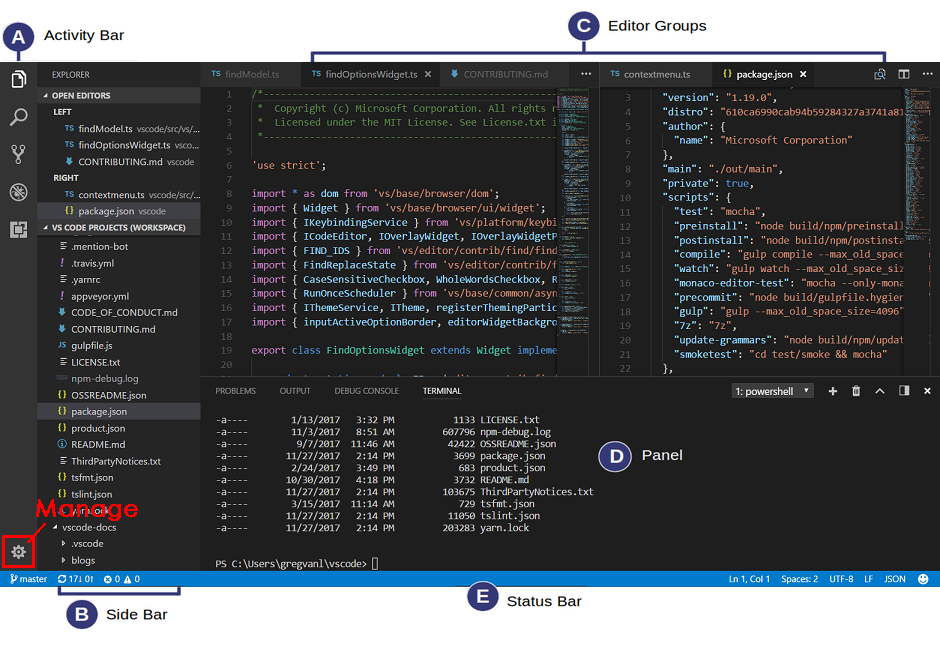
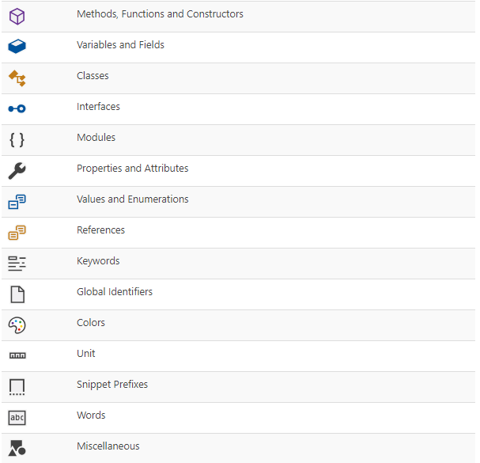
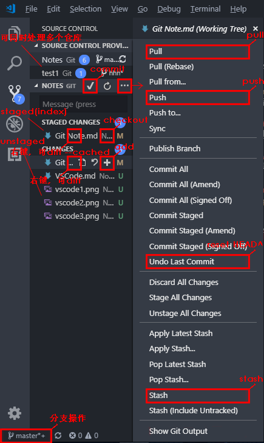
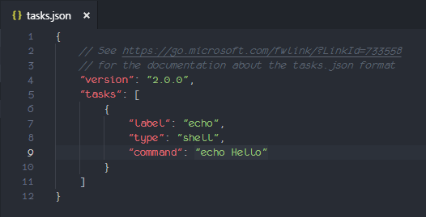
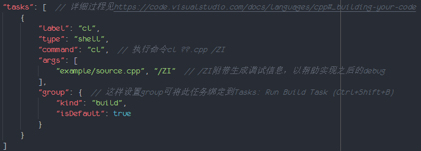

[TOC]

# One Picture



***本文仅对VS Code的结构和功能做最基本的阐述，如果你想了解VS Code更为细节、更为强大的部分，请参看其详实的文档。***


# Manage

## Command Palette

VS Code提供Command Palette的原因是，实现VS Code的纯键盘操作。因而，Command Palette中可使用的command纷繁复杂，涉及甚广。刚开始尝试可能会略觉繁复，使用多了便能体会其中便利。实在用不惯的话也不必担心，用你的鼠标就好。
```
Tips:
1.使用`Ctrl+Shift+P`打开Command Palette
2.使用`Tab`在VS Code中的各面板(UI)间切换，使用`Ctrl+M`唤醒the trapping of Tab
```

## Setting

VS Code的绝大多数配置均在Setting中，根据自己的习惯、需求设置Setting，可让你流畅、舒适地使用VS Code。

VS Code有2种Setting：

- User Setting: 是全局的，适用于所有文件。
- Workspace Setting: 仅适用于Workspace中的文件。在Workspace中，Workspace Setting会覆盖User Setting。
```
Notes:
Workspace有自己的Setting，这说明其是独立的空间，可用来承载单独的项目。
拥有.vscode的文件夹是Workspace，Workspace的所有配置文件均放在.vscode中。
当一个配置文件(setting.json、launch.json、tasks.json等)生成时，当前文件夹会被自动认定为Workspace（生成.vscode并将这个配置文件放在其中）。
```
所有修改过的配置均被写在settings.json文件中以最终生效。若手动修改settings.json，使用Ctrl+S（保存）后其会立刻生效。2种Setting各自对应的settings.json的位置：
<https://code.visualstudio.com/docs/getstarted/settings#_settings-file-locations>

```
Tips:
在Command Palette中搜索setting，利用其中command可直接打开Setting或settings.json文件，方便快捷！
```

## More(Style)

Manage中其余的部分都是个性化设置，比如Keyboard Shortcuts、Color Theme等。根据自己的习惯、喜好对这些进行设置后，你可以更加舒心地使用VS Code。

```
Tips:
在Command Palette中搜索想要修改的设置，比如Keyboard Shortcuts、Color Theme等，利用其中command可直接打开它们，方便快捷！
```


# Activity Bar

## Explorer

谁也不会质疑Explorer的存在，它是最基本的东西。在Explorer中右键一个文件，那里会有一些非常有用的操作，比如打开文件所在文件夹、获取文件路径、比较两文件内容等等。

一点点小惊喜是最下方的outline栏，它提供了 对当前代码中所有变量的基本概览（但也仅仅只是个概览）。其中各图标的含义是：



```
Tips:
1.使用`Ctrl+Shift+E`打开Explorer
2.使用`Ctrl+B`打开/关闭Side Bar
```

## Search

不同于使用Ctrl+F在当前文件中查找，Search是在整个Workspace/文件夹中进行全局的查找与替换。你可以在Search面板中设置哪些文件必须被检索，而哪些不必被检索。此外，Search支持使用正则表达式查找：<https://code.visualstudio.com/docs/editor/codebasics#_advanced-search-options>

```
Tips:
使用`Ctrl+Shift+F`打开Search
```

## Source(Version) Control

VS Code支持许多Source(Version) Control工具，内置支持Git，通过插件来支持其他工具，如SVN、Azure等。VS Code对Git的界面化支持简洁易用，辅助以一些插件，可用来替代Github Desktop。

当你打开的文件或文件夹 属于一个Git仓库时，VS Code便会认定这是你想要操作的仓库。之后Source Control面板会显示此仓库未提交的更改，并提供你便捷的界面以进行Git操作。VS Code可同时处理多个Git仓库，Source Control面板会显示出所有这些仓库的信息。

```
Tips:
使用`Ctrl+Shift+G`打开Source Control
```

一张图了解怎么在VS Code中完成基本的Git操作：



现在问题来了，仅简单使用的情况下，VS Code可以让你摆脱Git命令行操作吗？

- 你可使用Command Palette中的command来初始化一个仓库，可在Source Control面板中完成绝大多数的Git基本操作。但不用命令行，你无法设置remote，插件[Git: Add Remote](https://marketplace.visualstudio.com/items?itemName=samschneller.git-add-remote)可以解决这个问题。
- 你也可使用Command Palette中的comman来clone一个仓库。同上，你可界面化地完成大多数的Git操作。同时，你也不必再担心remote，因为这是clone的！
- VS Code的界面化Git操作不支持reset（回退）到指定版本，而插件[GitLens - Git supercharged](https://marketplace.visualstudio.com/items?itemName=eamodio.gitlens)支持。此插件还拥有很多强大的特性，极力推荐！

在VS Code中使用Git还有3个小优点：

- 所有界面化执行的Git操作，其对应的命令行代码都会被显示在Panel中的Output。
- 当你修改仓库中的文件时，行号旁会出现指示。红三角表示在此删除了一些行；绿条表示这是新加的行；蓝条则表示这是修改的行。
- 当你合并冲突时，VS Code会在冲突行前提供你解决的选项，你可双击选项一键解决冲突。

## Debug

Debug就是逐步运行程序以寻找bug的功能。编写代码时，你可以每写一步就确认一步的结果，但更推荐的做法是，写完整个代码再debug来逐步确认结果。

```
Tips:
1.使用`Ctrl+Shift+D`打开Debug
2.使用`F5`开始debug/continue（运行到下一个断点）
```

VS Code中，只有很少的程序可以直接debug，更多时候，你需设置一个launch.json来配置debug环境，之后才能开始debug：

1. 在Explorer面板中打开你想debug的程序所在的文件夹。（VS Code会视此文件夹为Workspace，将之后创建的launch.json放在其.vscode中）
2. 在Debug面板的右上角点击涡轮图标来创建launch.json，多数时候创建的launch.json都直接可用，无需再进行任何设置。

```
Notes:
1.如果你想使用的功能需要 生成一些配置文件.json，你都需要指定一个文件夹（自动成为Workspace）。也就是说Debug、Task等功能只能在Workspace中使用
2.你可能会觉得Workspace这东西又重又蠢，这是因为你才刚开始使用而已。当你使用多了后，你就会发现它真的很好用！
3.使用`Ctrl+K F`关闭 当前文件夹/Workspace 和 所有打开的文件
```

debug时，会出现一悬浮条，可执行的操作都在上面。同时，debug面板会显示 程序运行到当前位置 的所有状态与信息，比如当前所有存在变量及其值、函数的调用栈信息（多文件debug时很实用）等等，这些都非常有用。一个简单的debug例子：<https://code.visualstudio.com/docs/python/python-tutorial#_configure-and-run-the-debugger>

```
Tips:
1.使用`F5`continue（运行到下一个断点）
2.使用`Shift+F5`stop
3.使用`Ctrl+Shift+F5`restart
4.使用`F10`step over（单步运行，遇到子函数时不进入子函数，将子函数整个作为一步）
5.使用`F11`step into（单步运行，遇到子函数时进入子函数，在子函数内继续单步运行）
6.使用`Shift+F11`step out（在子函数内单步运行时，使用它可以运行完子函数余下的部分，返回到上一层函数）
```

在VS Code中进行Debug的强大之处是：

- debug面板中会显示非常有用的信息。
- Panel中的Debug Console提供了debug时与程序进行实时交互的强大功能：
	- 程序中的输出会实时显示在Debug Console中。
	- 你还可以在任意时刻通过Debug Console修改、使用当前时刻所有的变量、函数等。之后，程序会使用修改后的值继续运行。
- VS Code提供了各种类型的断点，以实现更为强大的功能：
	- <https://code.visualstudio.com/docs/editor/debugging#_logpoints>
	- <https://code.visualstudio.com/docs/editor/debugging#_advanced-breakpoint-topics>

VS Code中，多数语言的debugger都支持run，即Start Without Debugging。对于不支持run的debugger，run=debug。

```
Tips:
使用`Ctrl+F5`run(start without debugging)
```


# Panel

## Problems、Output、Debug Console

Problems中会提示当前程序中所有可能的错误，单击可跳转到对应错误处。

```
Tips:
使用`F8`和`Shift+F8`来回查看程序中错误的具体情况和修改意见
```

Output是只读的，是所有无处安放的信息、输出的集合地。除了 Debug的输出 和 能显示在Terminal的输出 外，其余所有可获取的信息与输出都被放在这里：

- 界面化执行Git操作时对应执行的命令。
- 一些插件(C#)安装时执行的命令。
- 一些插件(Code Runner)运行后得到的输出。
- 各种log信息：系统log信息、VS Code log信息等。
- ... so on

Debug Console提供了debug时与程序进行实时交互的强大功能。

```
Tips:
1.使用`Ctrl+Shift+Y`打开Debug Console
2.使用`Ctrl+J`打开/关闭Panel
```

## Terminal

VS Code集成了Terminal(CLI)，这提供了你更为便捷、一体化的操作，让你不用再在代码与Terminal之间来回切换。在VS Code中打开了文件夹或Workspace时，Terminal会从文件夹/Workspace的根目录启动；相反，Terminal则会从默认位置启动。

```
Tips:
使用`Ctrl+``打开Terminal
```

不同的系统，VS Code启动的默认Terminal(CLI)也不同。你可将想用的Terminal设置为默认Terminal以快速使用它，还可为这个Terminal传递参数：<https://code.visualstudio.com/docs/editor/integrated-terminal#_configuration>

你可以创建并使用多个Terminal来同时完成不同工作。使用面板中的 加号图标 和 垃圾桶图标 来创建和删除Terminal。输入命令时，输入bash、powershell、cmd可切换至相应的Terminal(CLI)。

```
Tips:
1.使用`Ctrl+Shift+``创建新Terminal
2.可在Keyboard Shortcuts中设置删除当前Terminal的快捷键
3.可在Keyboard Shortcuts中设置切换至前一个/后一个Terminal的快捷键
4.使用`Ctrl+Alt+PageUp/PageDown`scroll up/down(Line)
5.使用`Shift+PageUp/PageDown`scroll up/down(Page)
6.使用`Ctrl+Home/End`scroll to top/bottom
```

可以风格化Terminal，使其更为赏心悦目：<https://code.visualstudio.com/docs/editor/integrated-terminal#_terminal-display-settings>


# Status Bar

大概每个editor的Status Bar都是其最值得称赞的地方了。简洁、优雅并且极其实用，VS Code也是如此。你可以点击Status Bar中的各部分以查看和修改其值。
- 右侧是当前代码文件的相关环境信息及其可能存在的错误。
- 左侧则是最基础但又极为重要的文本相关设置，比如 当前光标所在的行列数、1Tab转换为几Spaces、编码方式、换行符为何等等。


# More Features

## Proxy

VS Code是基于Electron搭建的，其网络连接部分很大程度上得益于Google Chrome。

Chrome支持使用proxy server（代理服务器），因而VS Code也支持。两者使用proxy server的方式、过程都是一样的。打开Shadowsocks，VS Code将能像Chrome一样链接到一些被墙的内容。

```
Notes:
VS Code大概可能只有1%的内容被墙了，开不开代理、翻不翻墙，其实区别不大
```

VS Code对proxy server的支持并不完全。其插件不能使用proxy server，在CLI中操作VS Code也不能使用proxy server。

## IntelliSense

IntelliSense是对 代码补全，参数信息显示，推荐列表等 的总称，总之它可以根据你现在的环境，给予你恰当的信息与推荐。

你可以在任何需要输入文本的地方尝试调出它，以获得恰当的推荐。

```
Notes:
另一个在文本框中可尝试的技巧是@...，这是个filter，它可以帮你过滤筛选出你想要的内容
```
```
Tips:
使用`Ctrl+Space`调出/取消IntelliSense，如果按键冲突，请在Keyboard Shortcuts中设置成其他的快捷键
```

## Snippet

Snippet是自定义的可复用代码片段（模板）。你只需打出几个特定字符并在IntelliSense中选中它，VS Code便能帮我们自动补全为整个代码片段（模板）。

自定义有针对性的Snippets，能大大提升我们的编码效率。自定义Snippets及Snippets语法：
<https://code.visualstudio.com/docs/editor/userdefinedsnippets#_creating-your-own-snippets>

Snippet会公平地出现在IntelliSense的推荐中，如果你想改变其在推荐中的优先级，请参见：
<https://code.visualstudio.com/docs/editor/intellisense#_snippets-in-suggestions>

## Code Navigation

VS Code具有实用的导航功能，这保证了其既能给予你一个IDE才有的强大功能，又能保持一个editor应有的使用速度。

这些导航功能，你都能在右键菜单中找到。

```
Tips:
1.使用`F12`go to Definition
2.使用`Alt+F12`peek Definition
3.某些语言支持go to Implementation（与go to Definition不同），使用`Ctrl+F12`go to Implementation
4.某些语言支持go to Type Definition，可在Keyboard Shortcuts中设置此快捷键
5.使用`Shift+F12`peek(find) all References
6.使用`Ctrl+F2`change all Symbol - 当前文件中修改
7.某些语言支持rename Symbol，使用`F2`rename Symbol - 所有文件中修改
```

## Refactoring

Refactoring指在不改变运行结果的情况下，重构代码以实现更为优良的结构与可维护性。

VS Code提供了2种重构操作，均可在右键菜单中找到。一个文件中如果存在推荐重构的部分，则会在相应行左边显示小灯泡。

- Extract Method: <https://refactoring.com/catalog/extractFunction.html>
- Extract Variable: <https://refactoring.com/catalog/extractVariable.html>

```
Tips:
可在Keyboard Shortcuts中设置Extract Method、Extract Variable的快捷键：
https://code.visualstudio.com/docs/editor/refactoring#_keybindings-for-code-actions
```

## Task

很多外部工具在开发过程中都很有用，且它们都可以通过命令行来操作。一种便捷的方法是使用VS Code集成的Terminal，而另一种方法就是Task。run一个Task就是执行一个定义好的command。

```
Notes:
Task只能在Workspace中使用
```

一个例子来展示Task最基本的使用：

1. 在VS Code中打开一个文件夹。（VS Code会视此文件夹为Workspace，将之后创建的tasks.json放在其.vscode中）
2. 创建1个task：在Command Palette选中执行Tasks: Configure Task→Create tasks.json file from template→Others，VS Code自动生成如下tasks.json文件：
3. 运行这个task：在Command Palette选中执行Tasks: Run Task→echo→Continue without scanning the task output，运行后即可在Terminal中看到Task输出的结果Hello。

1个Workspace只有1个tasks.json，其自然能定义很多个任务，你只需根据形式、参数在tasks数组中继续添加即可。单个task中写“key”属性可绑定快捷键，按下快捷键便直接run这个task。tasks.json相关参数：

- <https://code.visualstudio.com/docs/editor/tasks#_custom-tasks>
- <https://code.visualstudio.com/docs/editor/tasks-appendix>

VS Code的Task非常强大，因而也非常复杂，不同工具需进行不同设置，有时还需设置额外文件。一个好的做法是，根据具体工具，上网寻找具体设置。VS Code已内置支持了一些强大工具，其具体的Task配置请参见VS Code官方文档。


# Language

## python

Anaconda庞大的体量让它看起来有点讨厌，但如果你不想深陷安装各种python依赖包的泥潭，你还是应该安装它。基本使用方法：<https://www.jianshu.com/p/eaee1fadc1e9>

执行命令conda install m2-base可让你在Anaconda虚拟环境中使用bash命令：<https://blog.csdn.net/shenquanyue/article/details/82733536>

Run&Debug：

1. VS Code中安装MS提供的官方插件[Python](https://marketplace.visualstudio.com/items?itemName=ms-python.python)。
2. run：在编写好的.py文件中右键，Run Python File in Terminal即可。
3. debug：插件中包含了python的debugger，设置launch.json后（自动生成）即可debug&run。

## c/c++

在c/c++这个问题上，MS显然更想让你去使用VS。因而MS的官方c/c++插件并不包含compiler和debugger，你需要自行下载这些。如果你已经有了VS，你也可以提取出VS中的c/c++ compiler来实现在VS Code中run、debug c/c++代码：

1. VS的c/c++ compiler是cl：<http://www.cnblogs.com/LCCRNblog/p/4532643.html>
2. cl虽是compiler，但使用命令cl ... /ZI可生成有调试信息的可执行文件，借此可实现debugger。请将...\Common7\IDE下的 mspdbcore.dll、mspdbsrv.dll、msobj??.dll 文件复制到...\VC\bin下，否则使用此命令会报错。
3. 独立地使用cl会报错是因为它是内置在VS中的，其并不独立，需要很多依赖文件。不开启VS而使用它意味着将无法找到这些依赖文件，解决方法只有将所需依赖文件放在cl.exe同一目录下。

```
Notes:
debug的实现有两种方式：
- 直接launch一个debugger（一种interpreter），对代码逐行interpret来实现debug
- 另一种是使用compiler将代码compile成有调试信息的可执行文件，attach到此可执行文件上以实现debug
也就是说debugger和compiler（需可生成调试信息）均可实现debug功能。
```
Run&Debug：

1. VS Code中安装MS提供的官方插件[C/C++](https://marketplace.visualstudio.com/items?itemName=ms-vscode.cpptools)。
2. 插件无法自动识别\#include引用库的路径，你需手动设置以不再让它报错。\#include语句下会出现绿色或红色波浪线，单击语句→单击小灯泡→选任一项，这会自动生成c_cpp_properties.json文件。将compiler路径写入"compilerPath"属性可在小灯泡选项中获得库路径的推荐，将库路径写入"includePath"属性以完成设置。
3. run：设置tasks.json来build你的代码（c的代码也请务必写在.cpp中而非.c中），之后 运行 生成的可执行文件即可。tasks.json的一个例子：
4. debug：debug前应先如上build你想debug的代码。点涡轮图标生成C++(Windows)模板的launch.json，将build出的可执行文件的路径写入"program"属性后即可debug&run。（若使用cl，debug时会提醒你一些文件找不到，忽视它即可。

```
Notes:
- build一般指 生成.exe(可执行文件)的过程，多数情况下就是compile的整个过程。有时仅指compile中的link步骤
- run指 生成并运行.exe(可执行文件)，得到output的过程
- debug指 逐步执行code(代码)以寻找bug的过程，其2种实现方式见上一Note
```

## c#

c#的境遇也如c/c++一样。MS的官方插件同样不包含compiler和debugger，更甚者，其仅支持.NET Core环境。这意味着你将不能如c/c++中那样使用任意compiler来实现run、debug，即便提取Windows系统中原生的.NET Framework中的c# compiler异常简单。

请先下载安装.NET Core：<https://dotnet.microsoft.com/learn/dotnet/hello-world-tutorial#install>

Run&Debug：

1. VS Code中安装MS提供的官方插件[C#](https://marketplace.visualstudio.com/items?itemName=ms-vscode.csharp)。
2. run：如上网址所示一般，创建新的.NET Core项目，在其中编写好代码，最后在CLI中执行dotnet run命令即可。
3. debug：插件会自动生成debug所需的tasks.json与launch.json文件（使用.NET Core中的c# debugger），F5即可debug，Ctrl+F5即可run。


## java

java、python这些VS并不一般涉及的语言，VS Code都支持的相当好。官方插件支持Maven、Eclipse和Gradle的java project。网站方向，安装相应插件也可很好支持Spring Boot和Tomcat：<https://code.visualstudio.com/docs/java/java-tutorial>

当然，一切的基础是你得下载并配置好java(JDK)。

Run&Debug：

1. VS Code中安装MS提供的官方插件[Java Extension Pack](https://marketplace.visualstudio.com/items?itemName=vscjava.vscode-java-pack)。
2. debug&run：debug时，插件会自检测java环境和java project，自动生成所需的launch.json，之后便可debug&run。


# Editor Group

好吧，写代码才是VS Code唯一需要完成的任务， 因为它本就只是个文本编辑器。之所以把这部分放在最后，是因为你需要记忆许多快捷键，这有点乏味。有效地使用它们可以大幅提升你的编码速度。

```
Tips:
1.使用`Ctrl+K Z`进入Zen模式（双Esc退出）
2.使用`Ctrl+K F`关闭当前文件夹/Workspace，同时也关闭所有打开的文件
3.使用`Shift+Alt+F`将当前代码按相应的编码规范格式化
4.在Exploer中使用`Alt+Click`在新editor中打开点击的文件
  使用`Ctrl+\`打开新editor
  使用`Ctrl+K W`关闭当前editor
  使用`Ctrl+1~9`切换editor
5.使用`Ctrl+N`打开新文件，可在Keyboard Shortcuts中重新设置此快捷键
  使用`Ctrl+P`打开现有文件，在其中使用→键可打开多个文件
  使用`Ctrl+F4`关闭当前tab
  使用`Ctrl+Shift+T`打开最后关闭的tab
  使用`Ctrl+Tab`切换tab
6.使用`Ctrl+G`跳转到指定行
  使用`Shift+Alt+↓`复制当前行
  使用`Shift+Delete`删除（剪切）当前行
  使用`Alt+↑/↓`移动当前行
7.在代码中使用`Alt+Click`进行多光标操作
  使用`Ctrl+D`在下一同名Symbol处添加光标
  使用`Shift+Alt+拖拽`得到多行光标
```


# Shortcuts

Manage:

Ctrl+Shift+p : 打开Command Palette（Esc关闭）

Activity Bar:

Ctrl+b : 打开/关闭Side Bar   Ctrl+Shift+e : 打开Explorer   Ctrl+Shift+f : 打开Search

Ctrl+Shift+g : 打开Source Control   Ctrl+Shift+d : 打开Debug

F5 : 开始debug/debug中continue   Shift+F5 : debug中stop  Ctrl+ Shift+F5 : debug中restart   Ctrl+F5 : 开始run

F10 : debug中step over   F11 : debug中step into   Shift+F11 : debug中step out

Panel:

Ctrl+j : 打开/关闭Panel   F8/Shift+F8 : 查看下/上一处错误的信息   Ctrl+Shift+y : 打开Debug Console

Ctrl+\` : 打开Terminal   Ctrl+Shift+\` : 创建新Terminal   Alt+\` : 删除当前Terminal（自定义的）

Ctrl+←/→ : 切换Terminal（自定义的）   Ctrl+Alt+PgUp/PgDn : Terminal中scroll up/down(Line)

Shift+PgUp/PgDn : Terminal中scroll up/down(Page)   Ctrl+Home/End : Terminal中scroll to top/bottom

More Features:

Ctrl+↓ : 调出IntelliSense（自定义的）

F12 : go to Definition   Alt+F12 : peek Definition   Ctrl+F2 : change all Symbol（当前文件中修改）

Editor Group:

Ctrl+k z : Zen模式（双Esc退出）   Ctrl+k f : 关闭当前文件夹/Workspace   Shift+Alt+f : 按编码规范格式化代码

Alt+Click（Exploer中） : 新editor中打开点击的文件   Ctrl+\ : 打开新editor   Ctrl+k w : 关闭当前editor   Ctrl+1~9 : 切换editor

Ctrl+t : 打开新文件（自定义的）   Ctrl+p : 打开现有文件（→键可打开多个文件）   Ctrl+F4 : 关闭当前tab

Ctrl+Shift+t : 打开最后关闭的tab   Ctrl+Tab : 切换tab

Ctrl+g : 跳转到指定行   Shift+Alt+↓ : 复制当前行   Shift+Del : 删除（剪切）当前行   Alt+↑/↓ : 移动当前行

Alt+Click（代码中） : 多光标操作   Ctrl+d : 在下一同名Symbol处添加光标   Shift+Alt+拖拽 : 多行光标

